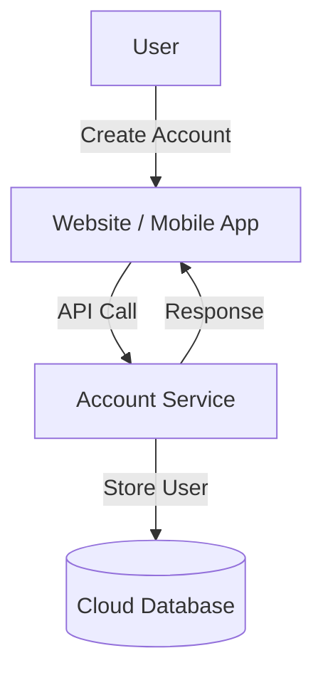
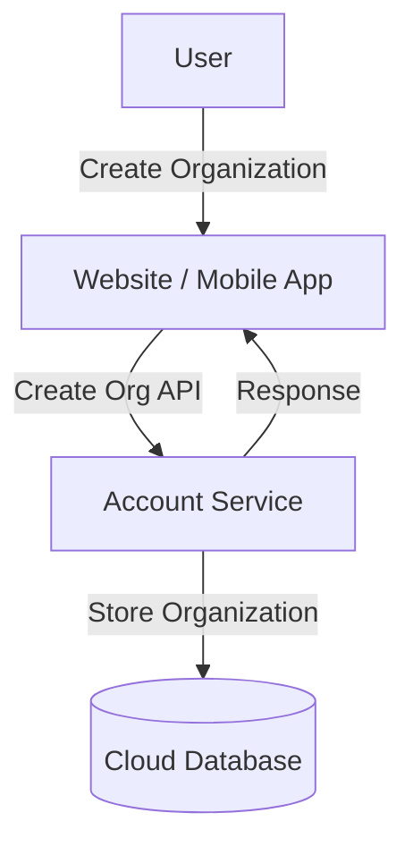
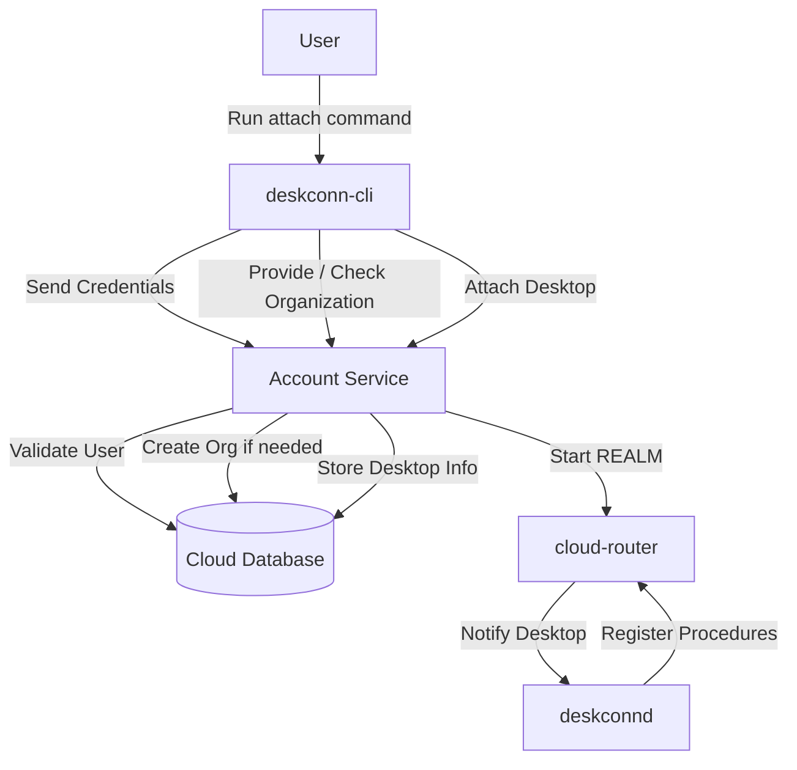
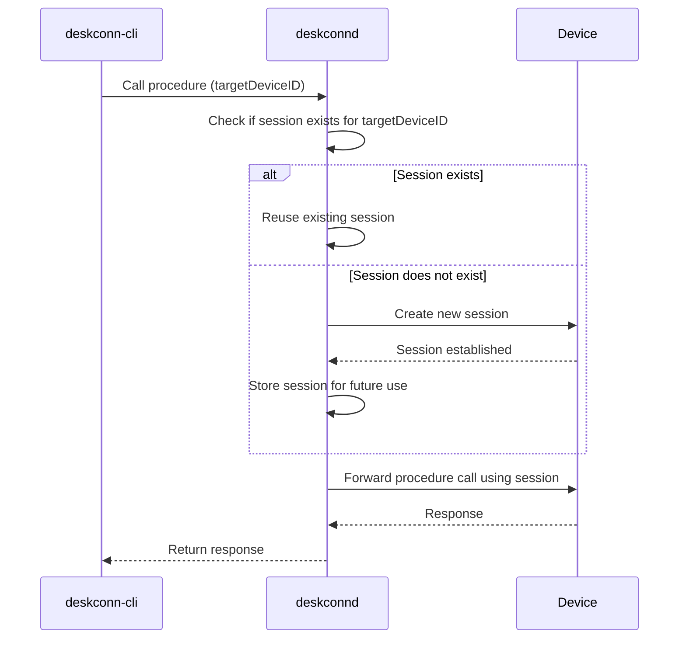

## Account Creation

```mermaid
flowchart TD

User[User]
App[Website / Mobile App]
AccountService[Account Service]
CloudDB[(Cloud Database)]

User -->|Create Account| App
App -->|API Call| AccountService
AccountService -->|Store User| CloudDB
AccountService -->|Response| App
```

## Organization Creation

```mermaid
flowchart TD

User[User]
App[Website / Mobile App]
AccountService[Account Service]
CloudDB[(Cloud Database)]

User -->|Create Organization| App
App -->|Create Org API| AccountService
AccountService -->|Store Organization| CloudDB
AccountService -->|Response| App
```

## Desktop Attach

```mermaid
flowchart TD

User[User]
DeskconnCLI[deskconn-cli]
AccountService[Account Service]
CloudDB[(Cloud Database)]
CloudRouter[cloud-router]
Deskconnd[deskconnd]

User -->|Run attach command| DeskconnCLI

DeskconnCLI -->|Send Credentials| AccountService
AccountService -->|Validate User| CloudDB

DeskconnCLI -->|Provide / Check Organization| AccountService
AccountService -->|Create Org if needed| CloudDB

DeskconnCLI -->|Attach Desktop| AccountService
AccountService -->|Store Desktop Info| CloudDB

AccountService -->|Start REALM| CloudRouter

CloudRouter -->|Notify Desktop| Deskconnd

Deskconnd -->|Register Procedures| CloudRouter
```

## Persistent connection

```mermaid
sequenceDiagram
    participant C as deskconn-cli
    participant D as deskconnd
    participant Dev as Device

    C->>D: Call procedure (targetDeviceID)

    D->>D: Check if session exists for targetDeviceID

    alt Session exists
        D->>D: Reuse existing session
    else Session does not exist
        D->>Dev: Create new session
        Dev-->>D: Session established
        D->>D: Store session for future use
    end

    D->>Dev: Forward procedure call using session
    Dev-->>D: Response
    D-->>C: Return response
```
