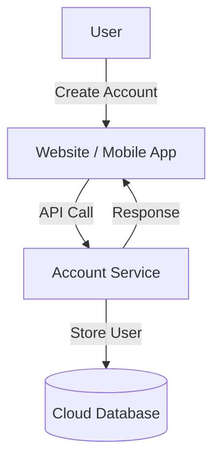
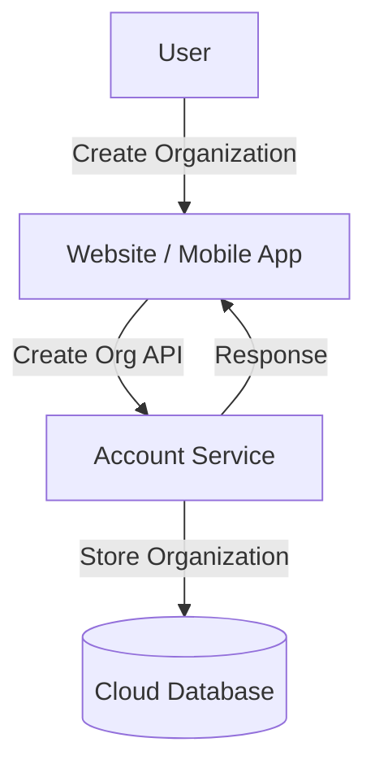
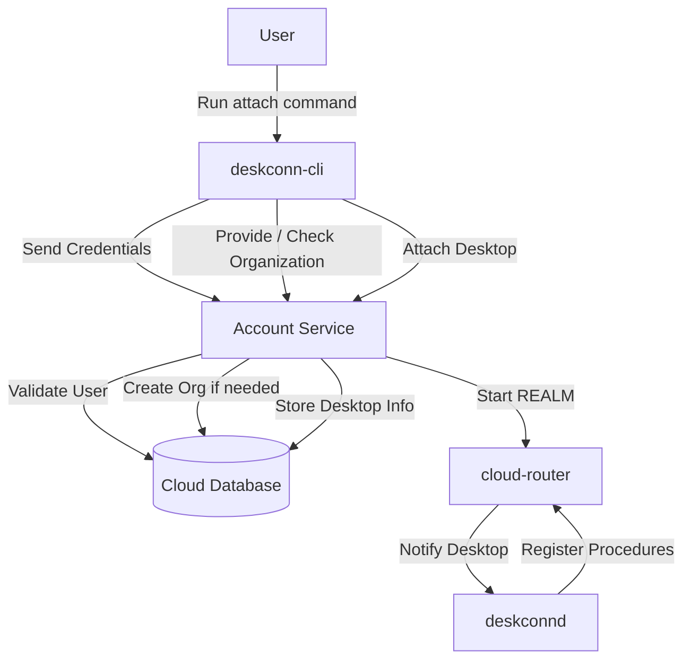
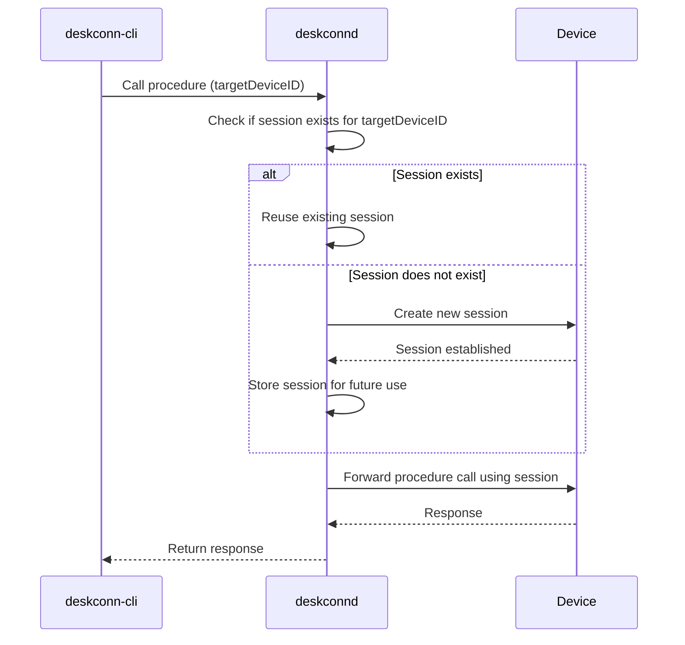
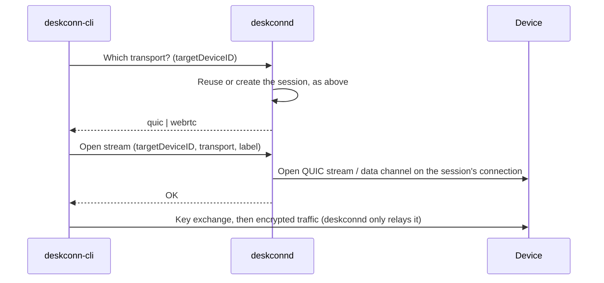

## Account Creation

## Organization Creation

## Desktop Attach

## Persistent connection

### Raw streams

Shell, exec, logs, port forwarding, agent forwarding and file transfer don't use procedure calls: they
run on raw streams opened alongside the session (QUIC streams, or WebRTC data channels once the
connection has upgraded to P2P). By default the CLI opens those on the same persistent connection,
through `deskconnd`'s stream proxy socket (`~/.deskconn/deskconn-streams.sock`), instead of connecting
to the device itself. `--mode quic` and `--mode p2p` still connect directly, as does the default mode
when `deskconnd` isn't running.

The two transports speak different protocols per feature, so `deskconnd` can't translate between them:
the CLI asks which one the connection has and uses that one for the whole operation. The key exchange
is end to end between the CLI and the device, so `deskconnd` relays ciphertext only.
